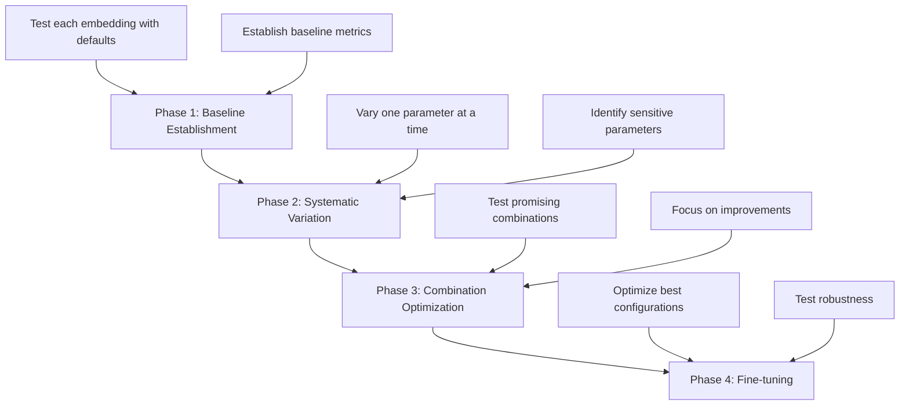

# Textual Clusterization using SOMs and Word Embeddings

<div align="center">
  <h2>X → Y Framework: From Raw Text to Clustered Visualization</h2>
</div>

---

## 📊 The Complete Process Flow

<table>
<tr>
<td width="30%" bgcolor="#DBEAFE">

### 🔵 X (Input)
**Textual Dataset**
- Documents/Articles
- Reviews/Comments
- News Articles
- Research Papers

</td>
<td width="40%" bgcolor="#F3E8FF">

### 🔄 Processing Pipeline

**Step 1: Word Embeddings**
- Word2Vec (CBOW/Skip-gram)
- GloVe
- FastText
- BERT

**Step 2: Feature Reduction**
- PCA
- t-SNE
- UMAP
- Autoencoder

**Step 3: SOM Training**
- Grid configuration
- Hyperparameter tuning
- Training iterations

</td>
<td width="30%" bgcolor="#D1FAE5">

### 🟢 Y (Output)
**SOM Visualization**
- Cluster map
- U-Matrix
- Component planes
- Hit histogram

**Metrics**
- Silhouette score
- Davies-Bouldin index
- Quantization error
- Topographic error

</td>
</tr>
</table>

---

## 🔬 STEP 1: Word Embeddings

<details open>
<summary><b>Word2Vec</b></summary>

**Architecture**: CBOW (Continuous Bag of Words) / Skip-gram

**Hyperparameters:**
| Parameter | Values |
|-----------|--------|
| Vector dimensions | 50, 100, 200, 300 |
| Context window size | 5, 10, 15 |
| Min word frequency | 1, 5, 10 |
| Training epochs | 10, 50, 100, 200 |
| Learning rate | 0.01, 0.025, 0.05 |

</details>

<details open>
<summary><b>GloVe (Global Vectors)</b></summary>

**Architecture**: Co-occurrence matrix factorization

**Hyperparameters:**
| Parameter | Values |
|-----------|--------|
| Vector dimensions | 50, 100, 200, 300 |
| Context window | 5, 10, 15 |
| X_max | 10, 50, 100 |
| Alpha | 0.75 |
| Training iterations | 50, 100, 200 |

</details>

<details open>
<summary><b>FastText</b></summary>

**Architecture**: Subword embeddings

**Hyperparameters:**
| Parameter | Values |
|-----------|--------|
| Vector dimensions | 50, 100, 200, 300 |
| Context window size | 5, 10, 15 |
| Min word frequency | 1, 5, 10 |
| Character n-grams | 3-6, 2-5 |
| Training epochs | 10, 50, 100 |

</details>

<details open>
<summary><b>BERT (Bidirectional Encoder Representations from Transformers)</b></summary>

**Architecture**: Transformer-based contextual embeddings

**Models:**
- **BERT-Base**: 768 dimensions, 12 layers
- **BERT-Large**: 1024 dimensions, 24 layers
- **DistilBERT**: 768 dimensions (lighter version)
- **Domain-specific BERT**: BioBERT, SciBERT, etc.

**Hyperparameters:**
| Parameter | Values |
|-----------|--------|
| Pooling strategy | [CLS] token, mean pooling, max pooling |
| Layer selection | Last layer, last 4 layers average, concatenate |
| Max sequence length | 128, 256, 512 |
| Fine-tuning | Frozen vs. fine-tuned on domain data |
| Batch size | 8, 16, 32 |

</details>

> **Output**: Dense vector representation of each document

---

## 📉 STEP 2: Dimensionality Reduction (Optional)

### Why Reduce Dimensions?
- ⚡ Computational efficiency for SOM training
- 🎯 Noise reduction
- 📊 Improved visualization
- 🎨 Better clustering performance

<details open>
<summary><b>PCA (Principal Component Analysis)</b></summary>

| Parameter | Values |
|-----------|--------|
| Number of components | 30, 50, 75, 100 |
| Variance retained | 0.90, 0.95, 0.99 |

</details>

<details open>
<summary><b>t-SNE (t-Distributed Stochastic Neighbor Embedding)</b></summary>

| Parameter | Values |
|-----------|--------|
| Perplexity | 5, 10, 30, 50 |
| Learning rate | 10, 100, 200, 1000 |
| Number of iterations | 1000, 2500, 5000 |
| Target dimensions | 2, 3, 10, 30 |

</details>

<details open>
<summary><b>UMAP (Uniform Manifold Approximation and Projection)</b></summary>

| Parameter | Values |
|-----------|--------|
| Number of neighbors | 5, 15, 30, 50 |
| Min distance | 0.0, 0.1, 0.25, 0.5 |
| Target dimensions | 2, 3, 10, 30 |

</details>

<details open>
<summary><b>Autoencoder</b></summary>

**Architecture:**
```
Encoder: [300 → 150 → 75 → 30]
Decoder: [30 → 75 → 150 → 300]
```

| Parameter | Values |
|-----------|--------|
| Latent dimension | 20, 30, 50, 100 |
| Activation function | ReLU, tanh, sigmoid |
| Learning rate | 0.001, 0.0001 |
| Epochs | 50, 100, 200 |

</details>

---

## 🗺️ STEP 3: Self-Organizing Map (SOM) Training

### Grid Architecture

| Parameter | Values |
|-----------|--------|
| Grid size | 5×5, 10×10, 15×15, 20×20, 25×25, 30×30 |
| Topology | Hexagonal / Rectangular |
| Distance metric | Euclidean, Manhattan, Cosine, Chebyshev |

### Training Parameters

| Parameter | Values |
|-----------|--------|
| Initial learning rate | 0.1, 0.3, 0.5, 0.7, 0.9 |
| Final learning rate | 0.01, 0.001 |
| Learning rate decay | Linear, exponential |
| Initial neighborhood radius | Grid size/2, or custom: 1, 3, 5, 10 |
| Final neighborhood radius | 0.5, 1.0 |
| Radius decay function | Linear, exponential |
| Training iterations | 1000, 5000, 10000, 20000, 50000 |
| Training mode | Batch vs. online learning |

### Initialization & Neighborhood

| Initialization Methods | Neighborhood Functions |
|------------------------|------------------------|
| Random initialization | Gaussian |
| PCA-based initialization | Bubble (step function) |
| Linear initialization | Mexican hat |
| | Epanechnikov |

---

## 🎯 Y (OUTPUT): SOM Visualizations & Metrics

### Visualization Techniques

<table>
<tr>
<td width="50%">

#### 1. U-Matrix (Unified Distance Matrix)
- Shows distances between neighboring neurons
- Reveals cluster boundaries
- Dark areas = boundaries
- Light areas = clusters

#### 2. Component Planes
- Separate map for each input feature
- Shows distribution of feature values
- Helps interpret cluster meaning

#### 3. Hit Histogram / Density Map
- Documents per neuron count
- Identifies popular vs. empty neurons
- Assesses map utilization

</td>
<td width="50%">

#### 4. Cluster Map
- Color-coded regions
- Distinct clusters visualization
- Post-processing result

#### 5. Sample Distribution Map
- Document-to-neuron mapping
- Clustering quality inspection
- Manual validation support

</td>
</tr>
</table>

### Evaluation Metrics

<table>
<tr>
<th>Clustering Quality Metrics</th>
<th>Range</th>
<th>Better When</th>
</tr>
<tr>
<td><b>Silhouette Score</b><br/>How similar objects are to their cluster</td>
<td>-1 to 1</td>
<td>Higher ↑</td>
</tr>
<tr>
<td><b>Davies-Bouldin Index</b><br/>Ratio of within/between cluster distances</td>
<td>0 to ∞</td>
<td>Lower ↓</td>
</tr>
<tr>
<td><b>Calinski-Harabasz Index</b><br/>Between/within cluster dispersion ratio</td>
<td>0 to ∞</td>
<td>Higher ↑</td>
</tr>
<tr>
<td><b>Dunn Index</b><br/>Min inter/max intra cluster distance</td>
<td>0 to ∞</td>
<td>Higher ↑</td>
</tr>
</table>

<table>
<tr>
<th>SOM-Specific Metrics</th>
<th>Description</th>
<th>Better When</th>
</tr>
<tr>
<td><b>Quantization Error</b></td>
<td>Average distance between data and BMU</td>
<td>Lower ↓</td>
</tr>
<tr>
<td><b>Topographic Error</b></td>
<td>Non-adjacent 1st/2nd BMU proportion</td>
<td>Lower ↓</td>
</tr>
<tr>
<td><b>Topographic Product</b></td>
<td>Topology preservation measure</td>
<td>Context-dependent</td>
</tr>
</table>

---

## 🧪 Experimental Configuration Matrix

| Exp ID | Embedding | Vector Dim | Reduction | Reduced Dim | SOM Grid | Topology | Learning Rate | Iterations | Quant. Error | Silhouette |
|--------|-----------|------------|-----------|-------------|----------|----------|---------------|------------|--------------|------------|
| **E001** | Word2Vec | 300 | None | 300 | 20×20 | Hex | 0.5 → 0.01 | 10000 | TBD | TBD |
| **E002** | Word2Vec | 300 | PCA | 50 | 20×20 | Hex | 0.5 → 0.01 | 10000 | TBD | TBD |
| **E003** | Word2Vec | 100 | None | 100 | 15×15 | Rect | 0.3 → 0.01 | 15000 | TBD | TBD |
| **E004** | GloVe | 300 | None | 300 | 20×20 | Hex | 0.5 → 0.01 | 10000 | TBD | TBD |
| **E005** | GloVe | 200 | t-SNE | 30 | 25×25 | Hex | 0.7 → 0.01 | 12000 | TBD | TBD |
| **E006** | FastText | 300 | PCA | 75 | 20×20 | Hex | 0.5 → 0.01 | 10000 | TBD | TBD |
| **E007** | FastText | 200 | UMAP | 30 | 15×15 | Rect | 0.4 → 0.01 | 20000 | TBD | TBD |
| **E008** | BERT-Base | 768 | PCA | 100 | 25×25 | Hex | 0.3 → 0.01 | 15000 | TBD | TBD |
| **E009** | BERT-Base | 768 | UMAP | 50 | 20×20 | Hex | 0.5 → 0.01 | 10000 | TBD | TBD |
| **E010** | BERT | 768 | t-SNE | 30 | 30×30 | Hex | 0.6 → 0.01 | 12000 | TBD | TBD |
| **E011** | DistilBERT | 768 | PCA | 75 | 20×20 | Rect | 0.4 → 0.01 | 15000 | TBD | TBD |
| **...** | ... | ... | ... | ... | ... | ... | ... | ... | ... | ... |

### 📋 Experiment Design Strategy



<table>
<tr>
<td width="25%">

**Phase 1:**<br/>Baseline<br/>Establishment
- Test each embedding type
- Default parameters
- Establish baselines

</td>
<td width="25%">

**Phase 2:**<br/>Systematic<br/>Variation
- One parameter at a time
- Keep others constant
- Identify sensitivity

</td>
<td width="25%">

**Phase 3:**<br/>Combination<br/>Optimization
- Test promising combos
- Focus on improvements
- Narrow down options

</td>
<td width="25%">

**Phase 4:**<br/>Fine-tuning
- Optimize best configs
- Edge cases testing
- Robustness validation

</td>
</tr>
</table>

---

## 🌍 Real-World Applications & Uses

<table>
<tr>
<td width="50%" valign="top">

### 📄 Document Organization & Management
- **Automatic document categorization**: Legal, medical, corporate repositories
- **Email classification**: Smart inbox management and auto-labeling
- **News article clustering**: Topic-based organization
- **Library systems**: Digital library organization
- **Knowledge bases**: Automatic tagging and organization

### 👥 Customer Intelligence & Sentiment Analysis
- **Review clustering**: Group similar customer feedback
- **Product feedback analysis**: Identify issues and feature requests
- **Support ticket routing**: Auto-assignment to departments
- **Voice of customer (VoC)**: Aggregate opinions by theme
- **Brand perception**: Monitor brand mentions and sentiment

### 🎓 Research & Academic Applications
- **Literature review**: Organize papers by research themes
- **Research trend identification**: Discover emerging topics
- **Citation network analysis**: Understand research communities
- **Patent analysis**: Group patents, identify innovation gaps
- **Bibliometric analysis**: Map scientific knowledge domains

### 🎯 Content Discovery & Recommendation
- **Recommendation systems**: Suggest similar articles/products
- **Content personalization**: User-specific content curation
- **Similar item search**: Find related content
- **Content gap analysis**: Identify missing topics
- **Cross-selling opportunities**: Discover related products

### 📱 Social Media & Web Analytics
- **Trend detection**: Identify emerging discussions
- **Community opinion mapping**: Understand public sentiment
- **Influencer identification**: Find topic experts
- **Crisis detection**: Early warning for negative trends
- **Campaign analysis**: Measure marketing effectiveness

</td>
<td width="50%" valign="top">

### 💼 Business Intelligence & Market Research
- **Competitive analysis**: Monitor competitor positioning
- **Market segmentation**: Identify customer groups
- **Product positioning**: Understand product landscape
- **Customer journey mapping**: Analyze touchpoints
- **Survey analysis**: Group open-ended responses

### 🏥 Healthcare & Medical Applications
- **Clinical notes clustering**: Group similar patient cases
- **Symptom analysis**: Identify disease patterns
- **Medical literature organization**: Evidence-based medicine
- **Drug interaction analysis**: From medical reports
- **Patient feedback analysis**: Improve care quality

### ⚖️ Legal & Compliance
- **Case law clustering**: Find similar legal precedents
- **Contract analysis**: Group similar clauses
- **Compliance monitoring**: Identify regulatory issues
- **Due diligence**: Organize investigation documents
- **E-discovery**: Legal document review

### 📚 Education & E-Learning
- **Student essay clustering**: Identify common themes
- **Course content organization**: Topic-based structuring
- **Question categorization**: Auto-tag questions by topic
- **Learning path recommendations**: Personalized content
- **Assessment analysis**: Group similar answers

### 🔒 Fraud Detection & Security
- **Fraud pattern detection**: Group suspicious activities
- **Phishing detection**: Identify similar scam messages
- **Incident clustering**: Group security events
- **Threat intelligence**: Categorize cyber threats
- **Anomaly detection**: Identify unusual patterns

</td>
</tr>
</table>

---

## 🏆 Your Thesis Contribution

<div align="center">

### 🎯 Research Objectives

</div>

1. **Systematic exploration** of word embedding techniques for text clustering
2. **Comparative analysis** of dimensionality reduction impact on clustering quality
3. **Optimization framework** for SOM hyperparameters in text clustering
4. **Best practice guidelines** for selecting appropriate configurations

<table>
<tr>
<td width="50%">

### 📊 Expected Outcomes
- ✅ Optimal embedding-SOM combinations identification
- ✅ Understanding computational cost vs. quality trade-offs
- ✅ Framework for technique selection
- ✅ Benchmarking across multiple metrics

### 🆕 Novelty
- 🔬 Comprehensive comparison including BERT
- 🔬 Complete pipeline evaluation (embedding → reduction → SOM)
- 🔬 Empirical best-practice guidelines
- 🔬 Open-source reproducible implementation

</td>
<td width="50%">

### 💡 Impact
- 🎯 Informed decision-making for practitioners
- 🎯 Reduced trial-and-error in pipeline design
- 🎯 Baseline results for future research
- 🎯 Multi-domain practical applications

### 🔬 Research Question
**"What is the optimal combination of word embeddings, dimensionality reduction, and SOM hyperparameters for textual clusterization?"**

</td>
</tr>
</table>

---

## 📈 Evaluation Framework

<table>
<tr>
<th width="33%">Quantitative Metrics</th>
<th width="33%">Qualitative Analysis</th>
<th width="33%">Statistical Analysis</th>
</tr>
<tr>
<td valign="top">

- Clustering quality scores
- Computational efficiency
- Training time
- Memory usage
- Scalability testing

</td>
<td valign="top">

- Visual cluster coherence
- Cluster interpretability
- Domain expert validation
- Manual inspection
- Use case testing

</td>
<td valign="top">

- Significance testing
- Confidence intervals
- Sensitivity analysis
- Hyperparameter impact
- Robustness testing

</td>
</tr>
</table>

---

## 🔧 Implementation Considerations

### Software & Tools

| Category | Tools |
|----------|-------|
| **Embeddings** | Gensim (Word2Vec, FastText), Transformers (BERT) |
| **Dimensionality** | scikit-learn (PCA, t-SNE), UMAP |
| **SOM** | MiniSom, SOMPY, Kohonen |
| **Visualization** | Matplotlib, Seaborn, Plotly |
| **Experiment Tracking** | MLflow, Weights & Biases, TensorBoard |
| **Version Control** | Git, GitHub, DVC (Data Version Control) |

### Computational Resources

| Resource | Requirement |
|----------|-------------|
| **GPU** | NVIDIA GPU for BERT embeddings (CUDA support) |
| **RAM** | 16GB minimum, 32GB+ recommended |
| **Storage** | SSD recommended for large datasets |
| **Processing** | Multi-core CPU for parallel experiments |
| **Cloud** | AWS/GCP/Azure for large-scale experiments |

### Dataset Considerations

- 📊 **Dataset size**: Number of documents and average length
- 🌐 **Language**: Monolingual vs. multilingual
- 📝 **Domain**: General vs. domain-specific vocabulary
- 🧹 **Preprocessing**: Tokenization, stopwords, stemming/lemmatization
- ⚖️ **Balance**: Class distribution in labeled datasets

---

## 📝 Presentation Tips for Your Professor

### 🎤 Key Talking Points

<table>
<tr>
<td width="50%">

**Opening:**
1. **Start with the problem**
   - Information overload
   - Need for automatic organization
   - Real-world impact

2. **Explain X → Y Framework**
   - Clear input/output mapping
   - Visual transformation journey
   - Measurable outcomes

3. **Emphasize Systematic Approach**
   - Not random experimentation
   - Structured methodology
   - Reproducible results

</td>
<td width="50%">

**Body:**
4. **Show Measurable Outcomes**
   - Multiple evaluation metrics
   - Quantitative comparisons
   - Statistical significance

5. **Demonstrate Practical Value**
   - Real-world applications
   - Industry relevance
   - Scalability potential

6. **Highlight Novelty**
   - BERT + SOM exploration
   - Comprehensive comparison
   - Complete pipeline analysis

</td>
</tr>
</table>

### 💡 Key Points to Emphasize

> ✨ **Completeness**: Comprehensive exploration across all major embedding techniques
> 
> 🔬 **Reproducibility**: Well-documented experiments with open-source code
> 
> 🎯 **Practical Value**: Direct applicability to real-world problems
> 
> 📊 **Scientific Rigor**: Multi-metric evaluation with statistical validation

---

## 📚 Academic Contribution Summary

<div align="center">

| Aspect | Details |
|--------|---------|
| **Research Question** | What is the optimal combination of word embeddings, dimensionality reduction, and SOM hyperparameters for textual clusterization? |
| **Methodology** | Systematic experimental evaluation across multiple configurations |
| **Evaluation** | Multi-metric quantitative assessment with qualitative validation |
| **Output** | Best practice framework and empirical guidelines |
| **Impact** | Practical tool for researchers and practitioners in text mining and NLP |

</div>

---

<div align="center">

### 🎓 End-to-End Thesis Process

**X (Raw Text)** → **Processing (Embeddings + Reduction + SOM)** → **Y (Clustered Visualization)**

*Systematic Exploration • Comparative Analysis • Optimization Framework • Best Practices*

</div>

---

## 📖 References & Further Reading

- **Self-Organizing Maps**: Kohonen, T. (2001). Self-Organizing Maps
- **Word2Vec**: Mikolov et al. (2013). Efficient Estimation of Word Representations
- **GloVe**: Pennington et al. (2014). GloVe: Global Vectors for Word Representation
- **FastText**: Bojanowski et al. (2017). Enriching Word Vectors with Subword Information
- **BERT**: Devlin et al. (2018). BERT: Pre-training of Deep Bidirectional Transformers
- **Text Clustering**: Aggarwal & Zhai (2012). Mining Text Data

---

<div align="center">

**© 2024 Thesis Project - Textual Clusterization using SOMs and Word Embeddings**

</div>
